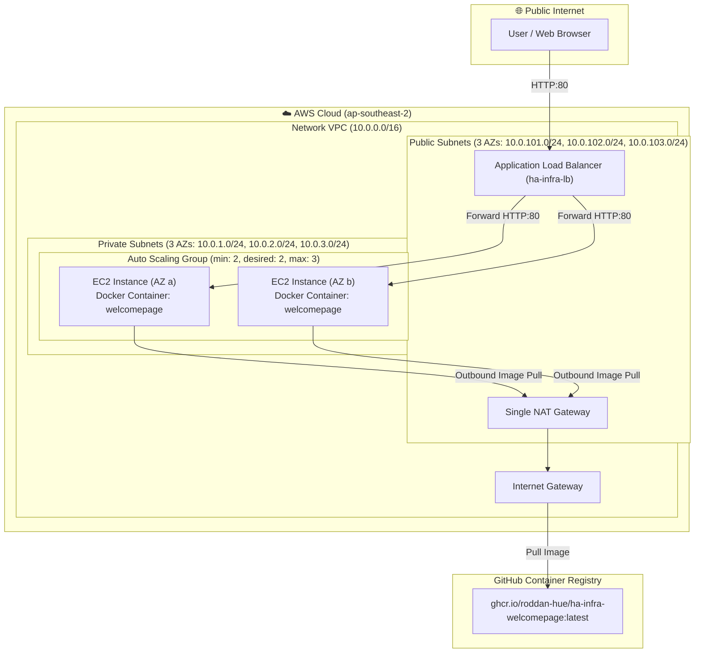

# Highly Available & Autohealing AWS Infrastructure (ha-infra)

[](https://github.com/roddan-hue/ha-infra/actions/workflows/terraform.yml)
[](https://github.com/roddan-hue/ha-infra/actions/workflows/docker-image.yml)

A production-grade, highly available (HA), self-healing web application infrastructure deployed on AWS using **Terraform (IaC)**, **Docker**, **GitHub Container Registry (GHCR)**, and **GitHub Actions CI/CD**.

---

## Architecture Overview

The infrastructure provisions a multi-Availability-Zone (AZ) network architecture in `ap-southeast-2` (Sydney) designed for high availability, zero single points of failure, autohealing, and secure network isolation.



---

## Key Features & Technical Requirements

| Requirement | Implementation & Design Detail |
| :--- | :--- |
| **Self-Healing (Autohealing)** | **ELB Health Checks & ASG Replacement**: The ALB Target Group actively probes instances on HTTP `/` every 30 seconds. The Auto Scaling Group is configured with `health_check_type = "ELB"`. If an application container fails or an instance becomes unhealthy, the ASG automatically terminates the instance and spins up a fresh replacement node. Additionally, Docker runs with `--restart unless-stopped` for process-level recovery. |
| **Self-Provisioning (IaC)** | **Single-Command Terraform Deployment**: The complete stack (VPC, Subnets, Internet Gateway, NAT Gateway, Security Groups, ALB, Target Groups, Launch Template, ASG, and User Data bootstrapper) is declared in `main.tf`. Running `terraform apply` provisions everything predictably; subsequent runs produce zero unneeded modifications. |
| **N+1 Capacity & HA** | **Multi-AZ Load Balancing**: Traffic is distributed evenly across at least 2 active EC2 instances deployed across multiple Availability Zones behind an Application Load Balancer. If one instance or AZ experiences an outage, 100% of incoming traffic is instantly rerouted to remaining active instances without user-facing downtime. |
| **Containerized Web Application** | **Angular SSR Docker Container**: The web application (`welcomepage/`) is built into a lightweight multi-stage Alpine Docker image and published to GitHub Container Registry (`ghcr.io`). Cloud-init/User-data installs Docker and pulls the image automatically on instance boot. |

---

## Infrastructure Component Breakdown

### 1. Networking & Security
- **VPC Module**: Standard AWS VPC (`10.0.0.0/16`) spanning 3 Availability Zones (`ap-southeast-2a`, `ap-southeast-2b`, `ap-southeast-2c`).
- **Subnet Isolation**:
  - **Public Subnets**: Host the ALB and NAT Gateway with direct Internet Gateway routing.
  - **Private Subnets**: Host EC2 application instances with no public IP addresses.
- **Security Groups**:
  - `ha-infra-alb-sg`: Accepts HTTP ingress on port 80 from `0.0.0.0/0`.
  - `ha-infra-instance-sg`: Accepts HTTP ingress on port 80 **strictly from `ha-infra-alb-sg`**. Public internet access directly to instances is blocked.

### 2. Compute & Scaling
- **Launch Template**: Provisioned with Amazon Linux 2 (`amzn2-ami-hvm-*-x86_64-gp2`), `t3.micro` instance type, and IMDSv2 token-based metadata access.
- **User Data Bootstrap**:
  ```bash
  #!/bin/bash
  yum update -y
  amazon-linux-extras install -y docker
  systemctl start docker && systemctl enable docker

  # Fetch instance-id via IMDSv2 (token-based, no IAM permissions needed)
  TOKEN=$(curl -s -X PUT "http://169.254.169.254/latest/api/token" \
    -H "X-aws-ec2-metadata-token-ttl-seconds: 21600")
  INSTANCE_NAME=$(curl -s -H "X-aws-ec2-metadata-token: $TOKEN" \
    http://169.254.169.254/latest/meta-data/instance-id)

  docker run -d --restart unless-stopped -p 80:4000 \
    -e NG_ALLOWED_HOSTS=* \
    -e INSTANCE_ID="$INSTANCE_NAME" \
    ghcr.io/roddan-hue/ha-infra-welcomepage:latest
  ```
- **Auto Scaling Group**: Configured with `min_size = 2`, `max_size = 3`, `desired_capacity = 2`. CPU Target Tracking scaling policy triggers additional capacity if average CPU utilization exceeds 50%.

---

## CI/CD & Git Workflow Architecture

The repository enforces a structured **Git Flow** with automated quality gates and controlled deployment approvals:

```
[ stage branch ] ──► (CI Validation: fmt, validate, plan, docker build)
                          │
                          ▼ Pull Request
[ main branch  ] ──► (Build & Push Docker image:latest)
                          │
                          ▼ Manual Approval / Dispatch
[ AWS Deployment ] ──► (terraform apply / terraform destroy)
```

### 1. `stage` Branch Pipeline
- **Triggers**: On push to `stage` branch.
- **Actions**:
  - `terraform fmt -check` (Enforces uniform HCL formatting)
  - `terraform validate` (Verifies configuration syntax)
  - `terraform plan` (Generates execution plan without applying)
  - Docker build validation (Ensures application builds cleanly)
- **Deployment**: **No deployment occurs on stage push.**

### 2. Pull Request to `main`
- Requires all CI validation checks to pass prior to merging.

### 3. `main` Branch Pipeline
- **Triggers**: On push/merge to `main` branch.
- **Actions**:
  - Builds and tags production Docker image (`ghcr.io/roddan-hue/ha-infra-welcomepage:latest`).
  - Runs `terraform plan` against HCP Terraform workspace.
- **Deployment**: ⏸️ **Deployment (`terraform apply`) and Teardown (`terraform destroy`) are manual / gated.** To deploy or destroy resources in AWS, navigate to **Actions -> Terraform Pipeline -> Run workflow**, select `action: apply` (or `action: destroy`), and click **Run workflow**.

---

## Prerequisites & Setup Guide

### 1. AWS & IAM OIDC Setup
Ensure an IAM Role exists in your AWS account with a trust relationship for GitHub Actions OIDC:
- Policy document location: [iam/github-oidc-terraform-policy.json]
- Store the Role ARN as a GitHub Actions secret: `AWS_ROLE_ARN`

### 2. GitHub Secrets & Variables Configuration
In your GitHub repository (`Settings -> Secrets and variables -> Actions`):
- **Secrets**:
  - `AWS_ROLE_ARN`: ARN of the IAM role to assume via OIDC.
  - `TF_API_TOKEN`: HCP Terraform API token with access to organization.
- **Variables**:
  - `AWS_REGION`: `ap-southeast-2`

### 3. Container Registry Permissions
Ensure the GHCR package (`ha-infra-welcomepage`) visibility is set to **Public** so EC2 instances in private subnets can pull the image without embedding private Docker credentials.

---

## Local Testing & Execution Guide

### Option A: Local Docker Application Testing
```bash
# 1. Navigate to web application directory
cd welcomepage

# 2. Build local Docker image
docker build -t welcomepage .

# 3. Run container locally on port 4000
docker run -d -p 4000:4000 --name welcomepage-test welcomepage

# 4. Verify local endpoint
curl http://localhost:4000

# 5. Clean up container
docker stop welcomepage-test && docker rm welcomepage-test
```

### Option B: Local Terraform CLI Deployment
```bash
# 1. Login to HCP Terraform
terraform login

# 2. Initialize modules and cloud backend
terraform init

# 3. Format and validate code
terraform fmt
terraform validate

# 4. Generate deployment plan
terraform plan

# 5. Deploy infrastructure to AWS
terraform apply -auto-approve

# 6. Retrieve outputs (e.g. ALB URL)
terraform output alb_url

# 7. Teardown infrastructure when finished
terraform destroy -auto-approve
```

---

## Testing Autohealing & High Availability

To verify the autohealing capability during testing:

1. **Verify Initial Health**:
   - Access the `alb_url` output in your browser. Traffic will load the Angular Welcome page, showing the EC2 instance ID of the serving instance.
2. **Simulate Application Failure**:
   - Terminate an EC2 instance directly via the AWS Console or AWS CLI:
     ```bash
     aws ec2 terminate-instances --instance-ids <instance-id> --region ap-southeast-2
     ```
3. **Observe Self-Healing Lifecycle**:
   - **Immediate Service Availability**: The ALB immediately detects the dead instance via target health probes and routes 100% of user traffic to the second active instance (zero downtime).
   - **ASG Auto-Replacement**: Within ~300 seconds (health check grace period), the ASG detects ELB target group failure, terminates the unhealthy node, and launches a fresh EC2 instance.
   - **Bootstrapping**: User-data executes, pulls `ghcr.io/roddan-hue/ha-infra-welcomepage:latest`, registers back with the Target Group, and restores full N+1 capacity.

---

## AWS Cost & FinOps Analysis (~$20 AUD Budget Context)

The infrastructure is optimized for technical demonstration while keeping costs strictly controlled:

| Resource | Quantity | Monthly Estimated Cost (USD) | Monthly Estimated Cost (AUD) | FinOps Optimization Strategy |
| :--- | :---: | :---: | :---: | :--- |
| **EC2 `t3.micro`** | 2 | $0.00 (AWS Free Tier) / ~$8.35 | ~$12.50 | Covered by AWS 12-month Free Tier (750 hrs/mo). |
| **Application Load Balancer** | 1 | ~$16.20 | ~$24.30 | Delete ALB (`terraform destroy`) when not testing. |
| **Single NAT Gateway** | 1 | ~$32.40 | ~$48.60 | `single_nat_gateway = true` is enabled to avoid provisioning 3 separate NAT Gateways across AZs. |
| **Data Transfer / Egress** | Minimal | < $1.00 | < $1.50 | Low bandwidth static page traffic. |

> [!TIP]
> **FinOps Recommendation**: To keep total spending strictly within the **~$20 AUD** budget threshold, run `terraform apply` when testing or demonstrating, and execute `terraform destroy` when inactive.